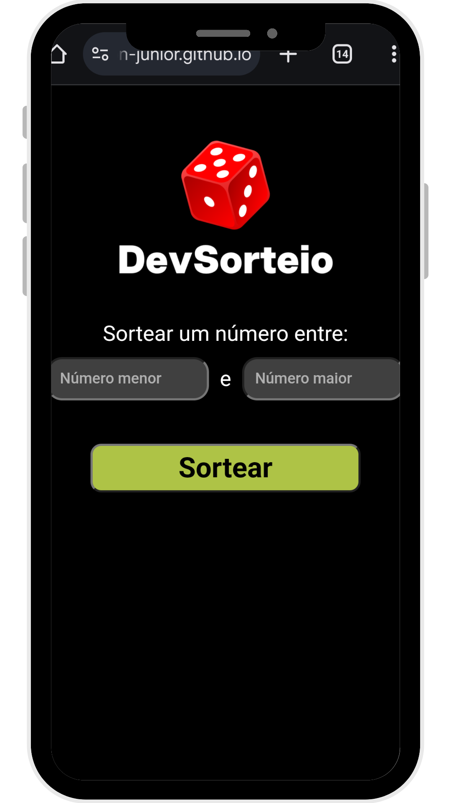

# 🎲 Sorteador de Números Aleatórios / Random Number Picker

Projeto interativo que permite ao usuário sortear um número aleatório dentro de um intervalo definido. Com validação de entrada e animação de carregamento para uma experiência mais fluida.

Interactive project that allows users to randomly pick a number within a custom range. Includes input validation and loading animation for a smooth experience.

---

## 🚀 Tecnologias utilizadas / Technologies Used

- **HTML5** – Estrutura / Page structure  
- **CSS3** – Estilização e animação / Styling and animation  
- **JavaScript** – Lógica do sorteio / Core logic and DOM interaction

---

## ✨ Funcionalidades / Features

- Definição de valor mínimo e máximo via inputs  
  User-defined minimum and maximum values
- Sorteio de número inteiro aleatório entre os valores informados  
  Random integer generation between provided values
- Mensagens de erro para:  
  Error messages for:
  - Campos vazios / Empty inputs  
  - Números iguais / Same numbers  
  - Valor mínimo maior que o máximo / Min greater than max
- Animação de carregamento com texto “Sorteando...”  
  Loading animation while picking a number
- Layout responsivo e intuitivo  
  Responsive and intuitive layout

---

## 📷 Preview do projeto / Project Preview

  
  

---

## ✅ Projeto finalizado

## 🧑‍💻 Desenvolvido por

Hudson Júnior  
 • 
